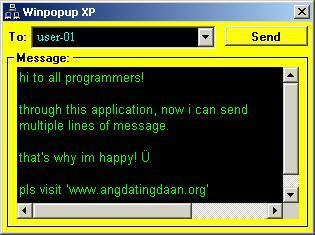



## a WINPOPUP XP

### Description

Send Multiple-line messages on a local area network (LAN), WITHOUT ACTIVE X, WITH ONLY ONE LINE OF CODE! You can also use this as a CHAT application. Short code, more explanation. You must only know the API "SHELL" function. Don't forget to VOTE for me!
 
### More Info
 

             |
---                |---
**Submitted On**   |2003-12-02 11:48:16
**By**             |[Lloyd Bellodo](https://github.com/Planet-Source-Code/PSCIndex/blob/master/ByAuthor/lloyd-bellodo.md)
**Level**          |Beginner
**User Rating**    |4.5 (77 globes from 17 users)
**Compatibility**  |VB 6\.0
**Category**       |[Windows API Call/ Explanation](https://github.com/Planet-Source-Code/PSCIndex/blob/master/ByCategory/windows-api-call-explanation__1-39.md)
**World**          |[Visual Basic](https://github.com/Planet-Source-Code/PSCIndex/blob/master/ByWorld/visual-basic.md)
**Archive File**   |[WINPOPUP\_X1678931212003\.zip](https://github.com/Planet-Source-Code/lloyd-bellodo-a-winpopup-xp__1-50254/archive/master.zip)

